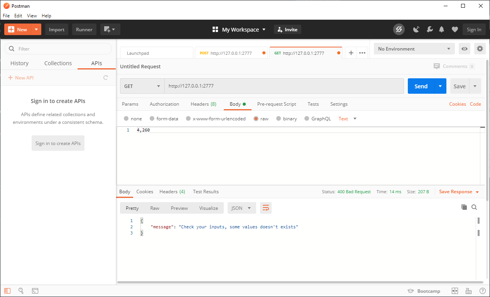
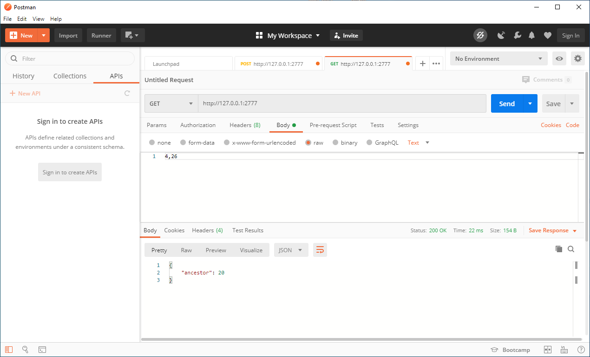
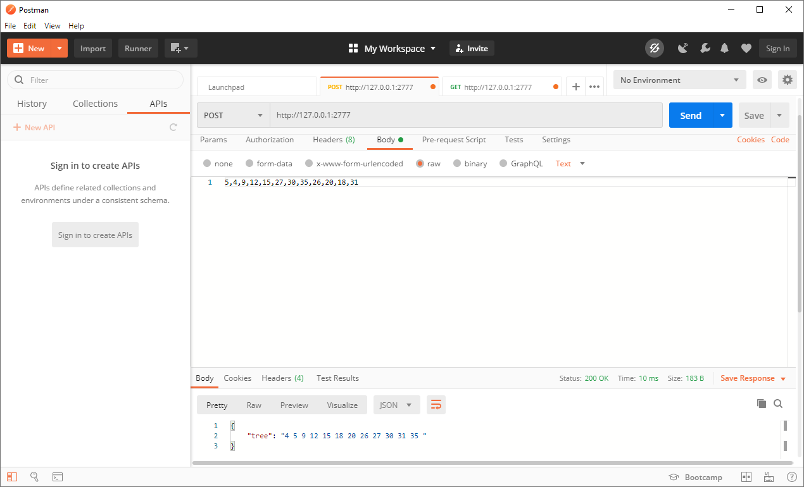
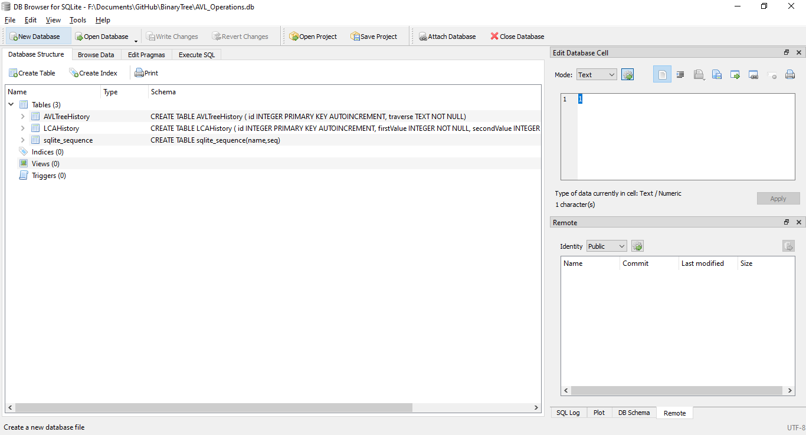
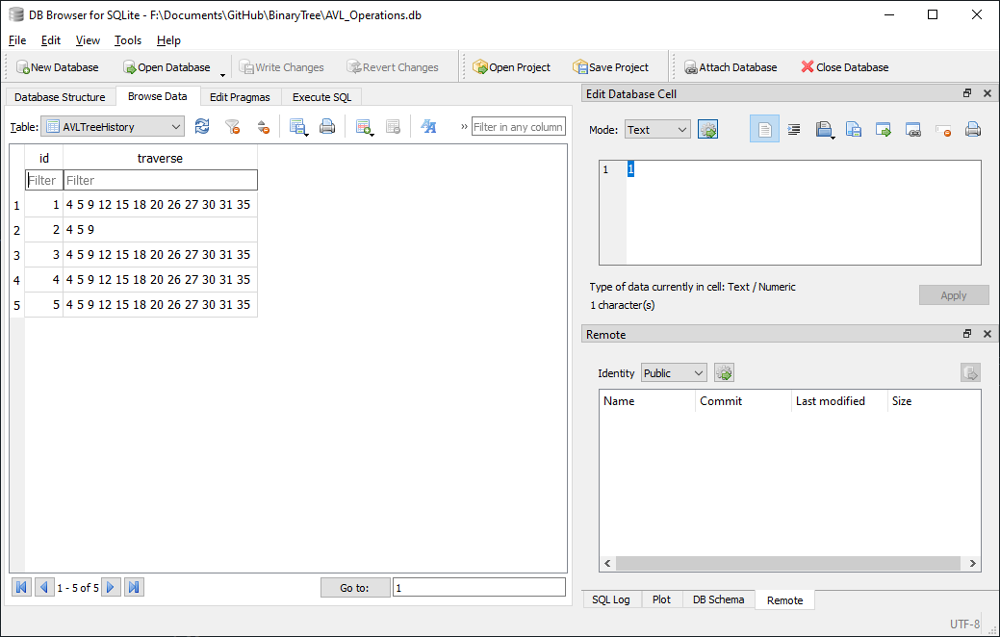
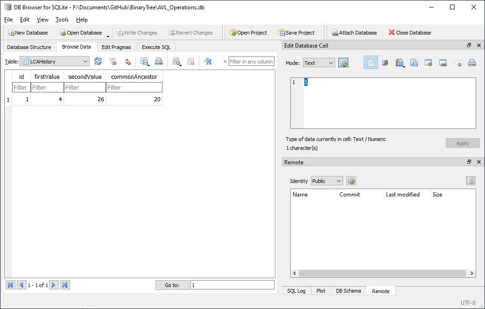

# BinaryTree
In order to remove slavery terms the stable branch it's called main instead of ~~master~~, to know more about this initiative please consider referring to this [thread](https://twitter.com/mislav/status/1270388510684598272). 

This repo intends to expose binary tree creation through Rest API using modern C++.

## Dependencies

> [!IMPORTANT]
> To get the dependencies installed, I used [vcpkg](https://aka.ms/vcpkg) and set the environment variable `VCPKG_ROOT`, this helps me to do not add the `CMAKE_TOOLCHAIN_FILE` parameter into the project build.

- [Microsoft C++ Rest SDK](https://github.com/Microsoft/cpprestsdk).
- [SQLite](https://sqlite.org/index.html).
    > [!TIP]
    > vcpkg have a [recipe](https://github.com/microsoft/vcpkg/blob/master/docs/examples/installing-and-using-packages.md) to get SQLite instaled, you should consider using it.

## Construction
Written using CMake and Modern C++, with VSCode and MS C++ compiler.

## Compilation
As this project was created using CMake, we have the following considerations:

- you should have a build folder in which the CMakeFiles will be written. 
- When you are located inside this folder run the command `CMake <path_to_source>`, where `<path_to_source>` is a placeholder which must be replaced with the path where codebase is located. 
- Finally the command `CMake --build .` will perform a call to the identified compiler, which will generate the executable file.

## Execution
The usage of the program should be done through the exposed API, by this moment it supports two operations:

|Method  |Description  |Parameters  |Consumes  |Produces  |
|---------|---------|---------|---------|---------|
|GET     |Given two numbers, find the common ancestor between them, and return a JSON object with it. | (int, int) each int corresponds with one of the tree leafs. | Plain text | JSON |
|POST     |Creates a new AVL tree based on the input data.| Comma separated values with all the nodes of the tree.| Plain text | JSON |

1. **GET**
This operation serves the feature of common ancestor, which consists in the retrieval of the common ancestor between two leafs, this method have certain considerations:
    - If you try to run it without creating first a tree, you will get a bad request error.
        
    - If you try to find the common ancestor between some numbers and at least one of them does not exists, you will get a bad request too.
        
    - When the operation is performed inside the correct boundary you should expect get a JSON object with the following structure `{ancestor:<int value>}` 
        

2. **POST**
This operation serves the feature of tree creation:

> [!CAUTION]
> Currently the ip addres and port number of the web service are harcoded and should be consumed in the ip **127.0.0.1** and port **2777**

An audit log of the transactions is saved into a SQLite database called `AVL_Operations.db` located in the current working directory. This database consists of two tables which holds the traversal paths of every created tree, and a copy of every request made to calculate common ancestors of two leafs when success.

- Database Structure: 
- Tree's Table example: 
- Common Ancestor's Table example: 